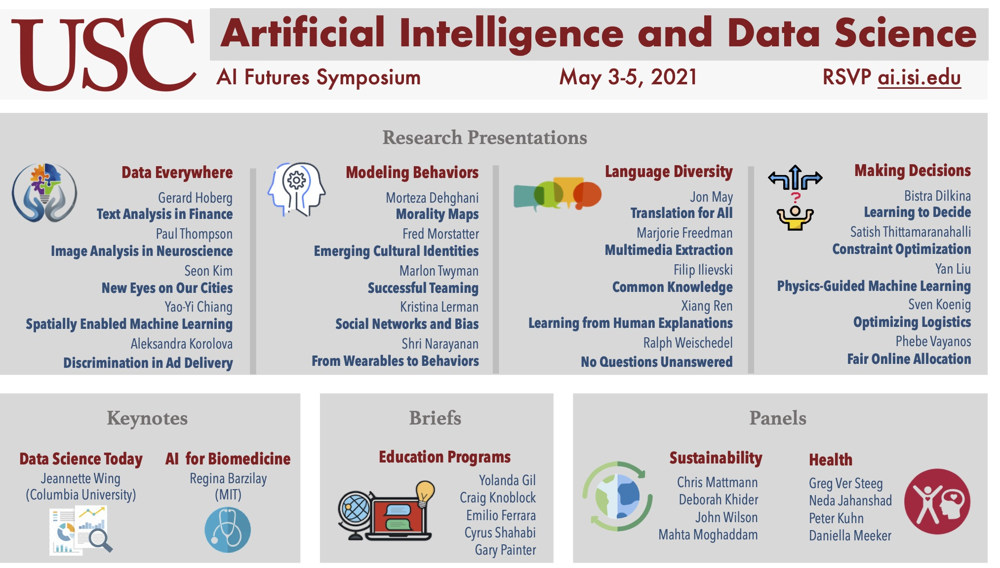
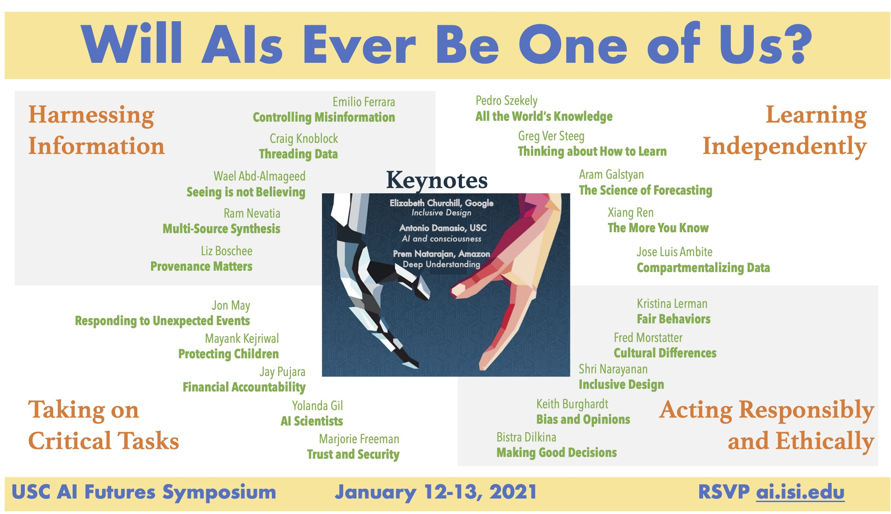

---

This event is part of the USC AI Futures Symposia Series.  The series is intended to highlight significant concentration areas of USC research in AI and related areas.  The speakers at these events are USC researchers, with some external invited speakers.  The symposia are held as virtual events.  

# Prior Events in the USC AI Futures Symposia Series

## December 7-8, 2021: AI with Common Sense

[Event website](https://www.isi.edu/events/ai-commonsense-symposium/)

## May 3-5, 2021: AI and Data Science

[Event website](https://www.isi.edu/events/ai-symposium/)

## January 12-13, 2021: Will AI Ever Be One of Us?

[Event website](https://www.isi.edu/events/ai_symposium_2021)

