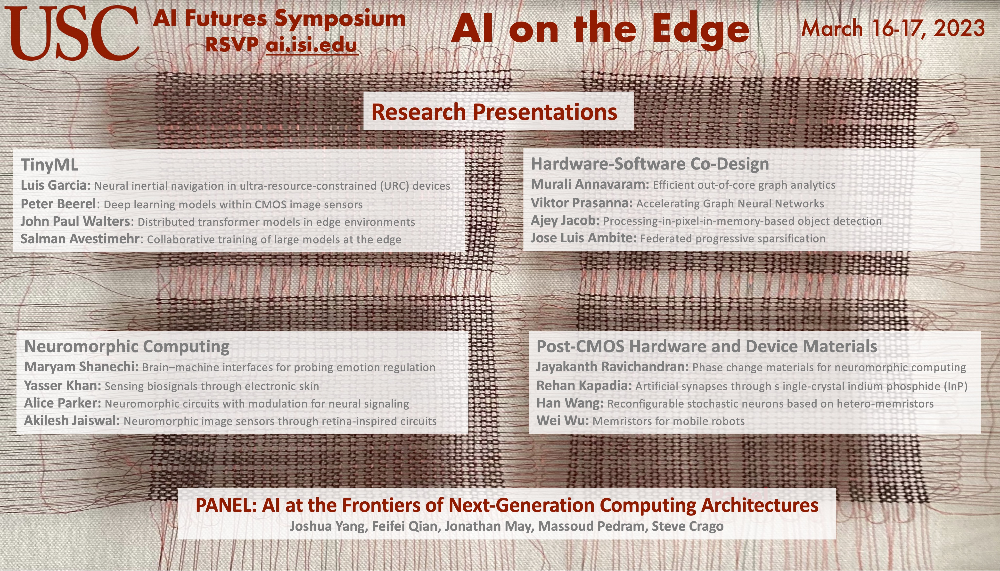

---

While ubiquitous sensing is rapidly growing in terms of both sensor numbers and data generating rate in the era of internet of things (IoT), we cannot afford to convert all the analog data into digital and send them to data centers to process anymore. Processing the data and extracting effective information as much as possible on the Edge (instead of in the Cloud) have become increasingly important to tackle this issue, which can only be done efficiently through AI on the Edge.  This symposium will present an overview of research at USC on AI on the Edge, from enabling hardware, algorithms, to the co-design of them.
 
This event is part of the USC AI Futures Symposium Series. Information about prior events and recordings are available here: [Will AIs Ever Be One of Us?](https://www.isi.edu/events/ai_symposium_2021).

## Schedule

The  agenda is available [here](./schedule).

## Attending

The event is free and open to everyone.  Please register [here](./register).

## Questions?

Please email any questions to **ai.isi.usc.edu@gmail.com**.

## Subscribe

Subscribe to our [USC AI Futures mailing list](https://mailman.isi.edu/mailman/listinfo/usc-ai-futures-events) to receive information about this and future events.
