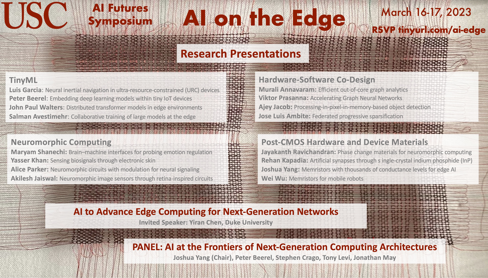

---

Intelligent data processing in edge devices has become increasingly important with the rapid growth of ubiquitous sensors and their data generation rates.  AI applications on the edge enable autonomous sensor steering, fast operations on smartphones, neuromorphic biodevices, and a vast array of Internet of Things (IoT) applications.  For these kinds of applications, it is not possible or practical to convert all the analog data into digital and send to data centers to process in the cloud.  There are many research challenges in terms of the design of algorithms and hardware required to support AI on the edge in terms of real-time processing at greater scale, storage capacity, and reduced energy consumption.
 
This symposium presents an overview of research innovations at USC on AI on the Edge, from enabling hardware and algorithms to their co-design.  Topics include AI and machine learning algorithms for edge devices and TinyML, bio-inspired and neuromorphic computing, new technologies and device materials beyond CMOS, and hardware-software co-design.
 
This event is part of the USC AI Futures Symposium Series. Information about prior events and recordings are available [here](./events).

## Schedule

The  agenda is available [here](./schedule).

## Attending

The event is free and open to everyone.  The event will be held virtually.  To receive a link please register [here](./register).

## Questions?

Please email any questions to **ai.isi.usc.edu@gmail.com**.

## Subscribe

Subscribe to our [USC AI Futures mailing list](https://mailman.isi.edu/mailman/listinfo/usc-ai-futures-events) to receive information about this and future events.
