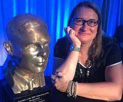
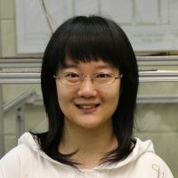

---

All times below are in PDT (Los Angeles time).

## Thursday 16 March, 2023

| Start |  End  |                                                  Session                                                 |                             Photo                             |
|:-----:|:-----:|:--------------------------------------------------------------------------------------------------------:|:-------------------------------------------------------------:|
|  9:00 |  9:15 | **Welcome and Opening Remarks**  
|       |       | **Symposium co-chairs: Joshua Yang and Yolanda Gil**                                                         |   |
|       |       | USC Viterbi Dean of Engineering: Yannis Yortsos                                                          | 
    |
|  9:15 | 10:05 | **TinyML – Machine Learning for edge devices**                                                          |                                                               |
|        |      | **Session chair: Jon May**                                                                                   | 
          |
|       |       | Luis Garcia: Neural inertial navigation in ultra-resource-constrained (URC) devices                      | 
       |
|       |       | Peter Beerel: Embedding deep learning models within foundry-manufacturable CMOS image sensor platforms   | 
      |
|       |       | John Paul Walters: Distributed transformer models in edge environments                                   | 
 |
|       |       | Salman Avestimehr: Collaborative training of large models at the edge                                    | 
 |
| 10:05 | 10:15 | Break                                                                                                    |                                                               |
| 10:15 | 11:05 | **Neuromorphic computing**                                                                                 |                                                               |
|       |       | **Session chair: Feifei Qian**                                                                               | 
       |
|       |       | Maryam Shanechi: Brain–machine interfaces (BMIs) for probing the neural mechanisms of emotion regulation | 
   |
|       |       | Yasser Khan: Sensing biosignals through electronic skin                                                  | 
      |
|       |       | Alice Parker: Neuromorphic circuits with modulation for neural signaling                                 | 
     |
|       |       | Akilesh Jaiswal: Neuromorphic image sensors through retina-inspired circuits                             | 
   |
| 11:15 | 12:00 | Invited Talk           |                                                               |

## Friday 17 March, 2023

| Start |  End  |                                                    Session                                                   |                                                                    |
|:-----:|:-----:|:------------------------------------------------------------------------------------------------------------:|--------------------------------------------------------------------|
|  9:00 |  9:50 | **Hardware-software co-design**                                                                                  |                                                                    |
|       |       | **Session chair: Keith Chugg**                                                                                   | 
          |
|       |       | Murali Annavaram: Out-of-core graph analytics through multi-log memory updates                               | 
       |
|       |       | Viktor Prasanna: Model-Architecture Co-design for High Performance Temporal GNN Inference on FPGAs           | 
        |
|       |       | Ajey Jacob: Processing-in-Pixel-in-Memory-based object Detection and Tracking                                | 
             |
|       |       | Jose Luis Ambite: Federated progressive sparsification                                                       | 
       |
|  9:50 | 10:00 | Break                                                                                                        |                                                                    |
| 10:00 | 10:50 | **Post-CMOS hardware and device materials**                                                                                                                                          |
|       |       | **Session chair: Steve Crago**                                                                                   | 
          |
|       |       | Jayakanth Ravichandran: Phase change materials for energy efficient neuromorphic computing                   | 
 |
|       |       | Rehan Kapadia: Single-crystal indium phosphide (InP) field effect transistor (FET)-based artificial synapses | 
          |
|       |       | Han Wang: Reconfigurable stochastic neurons based on tin oxide / molybdenum disulfide hetero-memristors      | 
               |
|       |       | Wei Wu: Hybrid analog-digital computing enabled by memristors for mobile robots                              | 
                 |
| 10:50 | 11:00 | Break                                                                                                        |                                                                    |
| 11:00 | 11:50 | **PANEL DISCUSSION: Future directions on AI on Edge - Chair: Joshua Yang**S                                       |                                                                    |
|       |       | Session chair: Joshua Yang                                                                                  |                                                                    |       
|       |       | Speakers TDB                                                                                                 |                                                                    |