---

**Video recordings of all the sessions are available <a href="https://www.youtube.com/playlist?list=PLknXvJJeEDaKQEcZmZkcR3j0hd8XJYsAe">here</a>.**

All times below are in PDT (Los Angeles time).

## Thursday 16 March, 2023

| Start |  End  |                                                  Session                                                 |                             Photo                             |
|:-----:|:-----:|:--------------------------------------------------------------------------------------------------------:|:-------------------------------------------------------------:|
|  9:00 |  9:15 | Welcome and Opening Remarks  Symposium co-chairs: Joshua Yang and Yolanda Gil                            |                                                               |
|       |       | USC Viterbi Dean of Engineering: Yannis Yortsos                                                          | 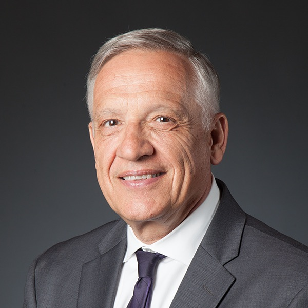{: width='200' }    |
|  9:15 | 10:05 | TinyML – Machine Learning for edge devices – Chair: Jon May                                              |                                                               |
|       |       | Luis Garcia: Neural inertial navigation in ultra-resource-constrained (URC) devices                      | 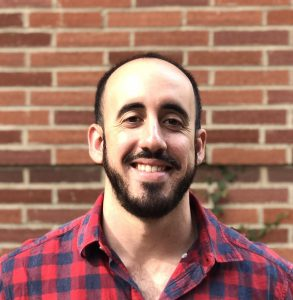{: width='200' }       |
|       |       | Peter Beerel: Embedding deep learning models within foundry-manufacturable CMOS image sensor platforms   | {: width='200' }      |
|       |       | John Paul Walters: Distributed transformer models in edge environments                                   | 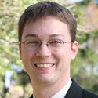{: width='200' } |
|       |       | Salman Avestimehr: Collaborative training of large models at the edge                                    | 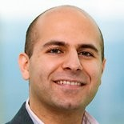{: width='200' } |
| 10:05 | 10:15 | Break                                                                                                    |                                                               |
| 10:15 | 11:05 | Neuromorphic computing – Chair: Feifei Qian                                                              |                                                               |
|       |       | Maryam Shanechi: Brain–machine interfaces (BMIs) for probing the neural mechanisms of emotion regulation | 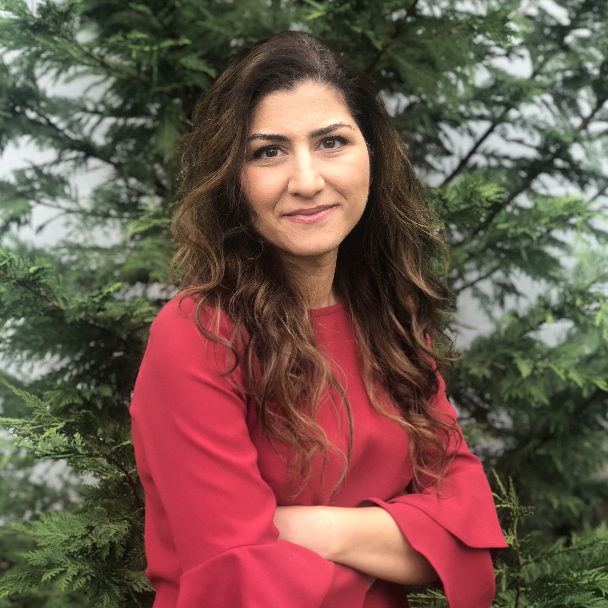{: width='200' }   |
|       |       | Yasser Khan: Sensing biosignals through electronic skin                                                  | 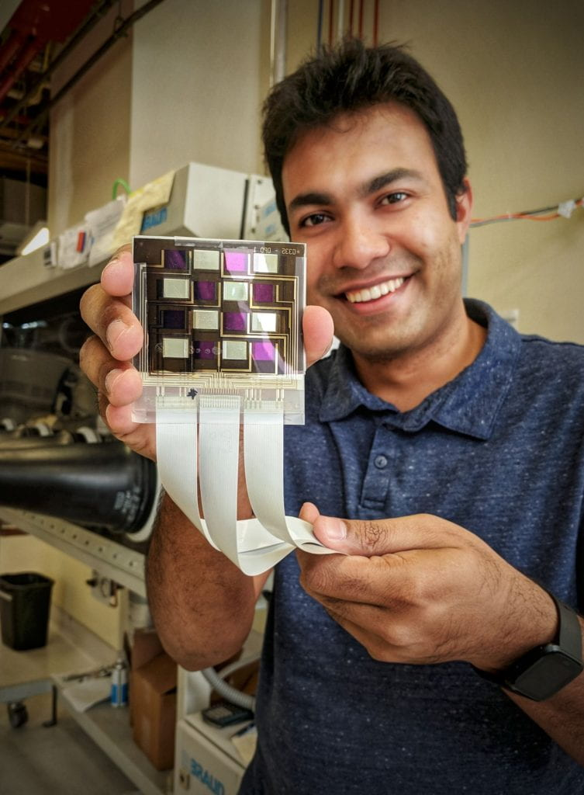{: width='200' }      |
|       |       | Alice Parker: Neuromorphic circuits with modulation for neural signaling                                 | 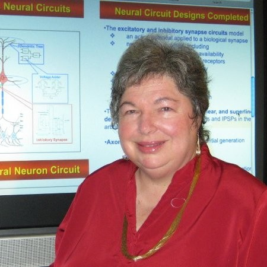{: width='200' }     |
|       |       | Akilesh Jaiswal: Neuromorphic image sensors through retina-inspired circuits                             | 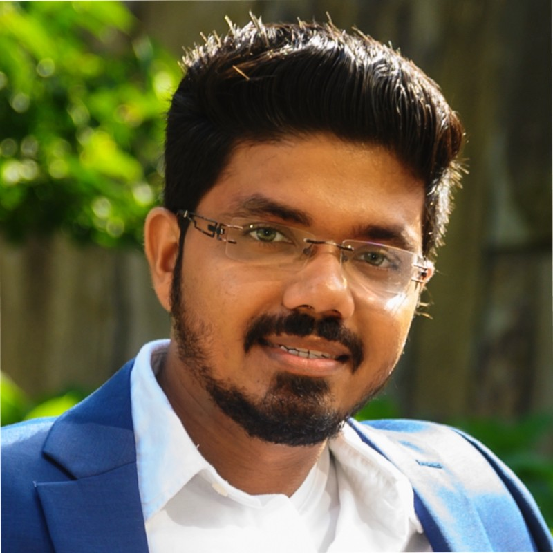{: width='200' }   |
| 11:15 | 12:00 | Invited Talk           |                                                               |

## Friday 17 March, 2023

| Start |  End  |                                                    Session                                                   |                                                                    |
|:-----:|:-----:|:------------------------------------------------------------------------------------------------------------:|--------------------------------------------------------------------|
|  9:00 |  9:50 | Hardware-software co-design – Chair: Keith Chugg                                                             |                                                                    |
|       |       | Murali Annavaram: Out-of-core graph analytics through multi-log memory updates                               | 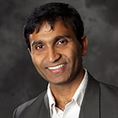{: width='200' }       |
|       |       | Viktor Prasanna: Model-Architecture Co-design for High Performance Temporal GNN Inference on FPGAs           | 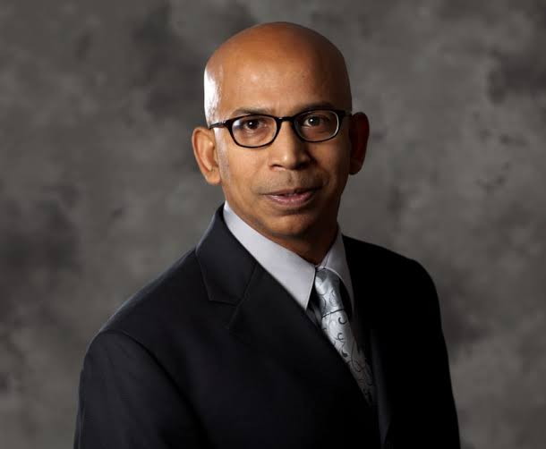{: width='200' }        |
|       |       | Ajey Jacob: Processing-in-Pixel-in-Memory-based object Detection and Tracking                                | 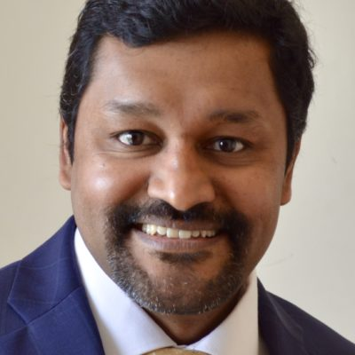{: width='200' }             |
|       |       | Jose Luis Ambite: Federated progressive sparsification                                                       | 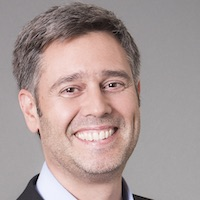{: width='200' }       |
|  9:50 | 10:00 | Break                                                                                                        |                                                                    |
| 10:00 | 10:50 | Post-CMOS hardware and device materials – Chair: Steve Crago                                                 |                                                                    |
|       |       | Jayakanth Ravichandran: Phase change materials for energy efficient neuromorphic computing                   | 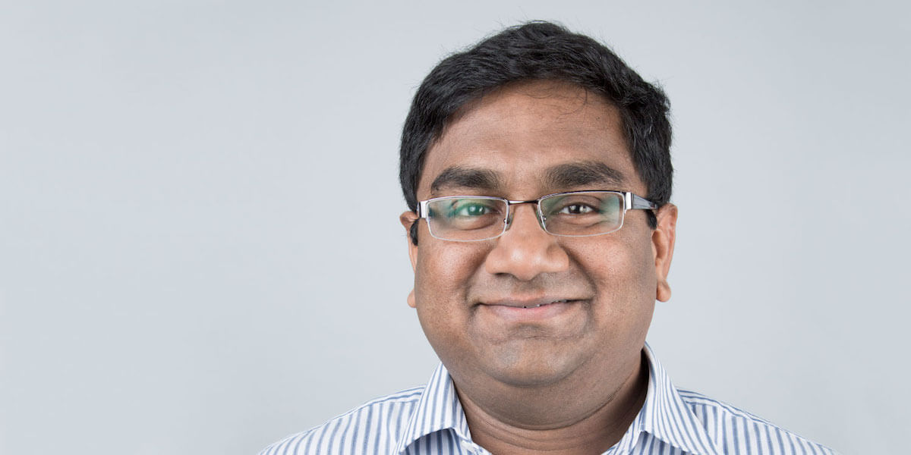{: width='200' } |
|       |       | Rehan Kapadia: Single-crystal indium phosphide (InP) field effect transistor (FET)-based artificial synapses | 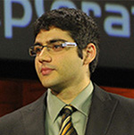{: width='200' }          |
|       |       | Han Wang: Reconfigurable stochastic neurons based on tin oxide / molybdenum disulfide hetero-memristors      | 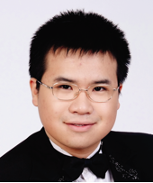{: width='200' }               |
|       |       | Wei Wu: Hybrid analog-digital computing enabled by memristors for mobile robots                              | 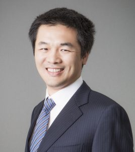{: width='200' }                 |
| 10:50 | 11:00 | Break                                                                                                        |                                                                    |
| 11:00 | 11:50 | PANEL DISCUSSION: Future directions on AI on Edge - Chair: Joshua Yang                                       |                                                                    |
|       |       | Speakers TDB                                                                                                 |                                                                    |