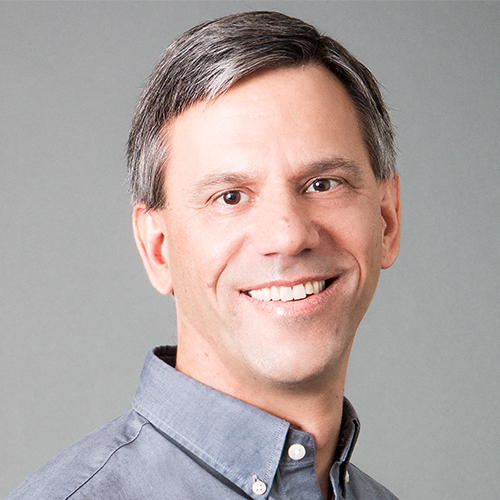
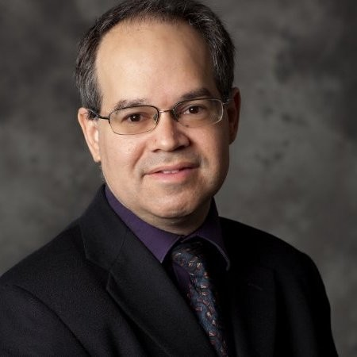
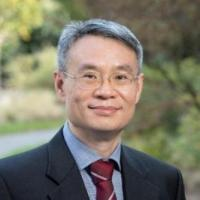
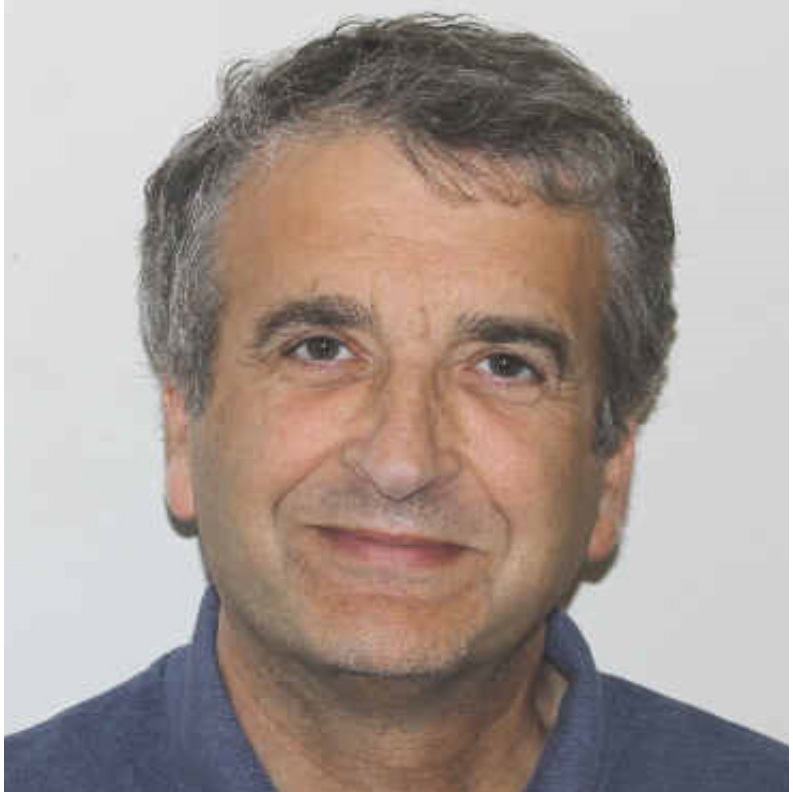
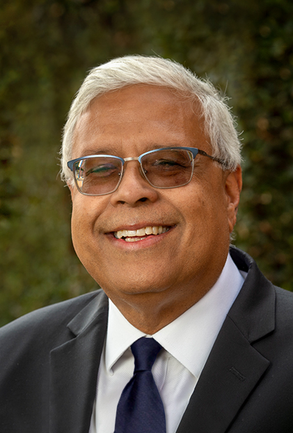

---

The event will be held virtually.  To receive a link please register [here](./register).

All times below are in PDT (Los Angeles time).

## Thursday 16 March, 2023

| Start |  End  |                                                 Session                                                  |                                                                   Speakers                                                                    |
| :---: | :---: | :------------------------------------------------------------------------------------------------------: | :----------------------------------------------------------------------------------------------------------------------------------------: |
| 9:00  | 9:15  |                                     **Welcome and Opening Remarks**                                      |
|  |  | [Joshua Yang](https://viterbi.usc.edu/directory/faculty/Yang/J-Joshua) (Symposium Co-Chair)   Professor of Electrical and Computer Engineering, Viterbi School of Engineering |  |
|  |  | [Yolanda Gil](https://viterbi.usc.edu/directory/faculty/Gil/Yolanda) (Symposium Co-Chair)   Senior Director, Information Sciences Institute, Viterbi School of Engineering; Director, Data Science Programs, Computer Science Department, Viterbi School of Engineering; Research Professor of Computer Science, Viterbi School of Engineering |  |
|  |  | [Yannis Yortsos](https://viterbi.usc.edu/directory/faculty/Yortsos/Yannis)   Dean of the Viterbi School of Engineering; Zohrab A. Kaprielian Dean’s Chair in Engineering and Chester Dolley Professor of Chemical and Petroleum Engineering, Viterbi School of Engineering |  |
|  |  | [Craig Knoblock](https://usc-isi-i2.github.io/knoblock/)   Keston Executive Director, Information Sciences Institute, Viterbi School of Engineering; Vice Dean of Engineering, Viterbi School of Engineering; Research Professor of Computer Science, Viterbi School of Engineering |  |
| 9:15  | 10:05 |                              **Session I: TinyML – Machine Learning for edge devices**                              |                                                                                                                                            |
|       |       |                                        Session chair: [Jonathan May](https://viterbi.usc.edu/directory/faculty/May/Jonathan)   Research Associate Professor of Computer Science, Viterbi School of Engineering; Research Team Leader, Information Sciences Institute, Viterbi School of Engineering                                        |                                                                             | 
|       |       |           *Neural inertial navigation in ultra-resource-constrained (URC) devices*   [Luis Garcia](https://lagarcia.us/)   Research Assistant Professor of Computer Science, Viterbi School of Engineering; Research Lead, Information Sciences Institute, Viterbi School of Engineering            |                                                                         |
|       |       |  *Embedding deep learning models within tiny IoT devices*   [Peter Beerel](https://viterbi.usc.edu/directory/faculty/Beerel/Peter)   Professor of Electrical and Computer Engineering, Viterbi School of Engineering  |                                                                        |
|       |       |                  *Distributed transformer models in edge environments*   [John Paul Walters](https://www.isi.edu/directory/jwalters/)   Research Director, Information Sciences Institute, Viterbi School of Engineering                 |                                                                   |
|       |       |                  *Collaborative training of large models at the edge*   [Salman Avestimehr](https://viterbi.usc.edu/directory/faculty/Avestimehr/Salman)   Dean's Professor of Electrical and Computer Engineering and Computer Science, Viterbi School of Engineering                    |                                                                   |
| 10:05 | 10:15 |                                                  Break                                                   |                                                                                                                                            |
| 10:15 | 11:05 |                                        **Session II: Neuromorphic computing**                                        |                                                                                                                                            |
|       |       |                                        Session chair: [Stephen Crago]()   Associate Director, Information Sciences Institute, Viterbi School of Engineering; Research Associate Professor of Electrical and Computer Engineering, Viterbi School of Engineering                                        |             |
|       |       | *Brain–machine interfaces for probing the neural mechanisms of emotion regulation*   [Maryam Shanechi](https://viterbi.usc.edu/directory/faculty/Shanechi/Maryam)   Andrew and Erna Viterbi Early Career Chair and Associate Professor of Electrical and Computer Engineering - Systems, Biomedical Engineering, and Computer Science, Viterbi School of Engineering      |                                                                     |
|       |       |                         *Sensing biosignals through electronic skin*   [Yasser Khan](https://viterbi.usc.edu/directory/faculty/Khan/Yasser)   Assistant Professor of Electrical and Computer Engineering, Viterbi School of Engineering                          |                                                                         |
|       |       |                 *Neuromorphic circuits with modulation for neural signaling*   [Alice Parker](https://viterbi.usc.edu/directory/faculty/Parker/Alice)   Professor Emerita of Electrical and Computer Engineering, Viterbi School of Engineering                  |                                                                        |
|       |       |               *Neuromorphic image sensors through retina-inspired circuits*   [Akhilesh Jaiswal](https://viterbi.usc.edu/directory/faculty/Jaiswal/Akhilesh)   Research Assistant Professor of Electrical and Computer Engineering, Viterbi School of Engineering; Research Scientist, Information Sciences Institute, Viterbi School of Engineering               |                                                                     |
| 11:15 | 12:00 |                            **Invited Talk**                             |                                                                                |
|       |       |                                               *AI to Advance Edge Computing for Next-Generation Networks*   [Yiran Chen](https://ece.duke.edu/faculty/yiran-chen)   Professor of Electrical and Computer Engineering, Duke University                                              |                                                                                                                                             |

## Friday 17 March, 2023

| Start |  End  |                                                 Session                                                  |                                                                   Speakers                                                                    |
| :---: | :---: | :------------------------------------------------------------------------------------------------------: | :----------------------------------------------------------------------------------------------------------------------------------------: |
| 9:00  | 9:50  |                                       **Session III: Hardware-software co-design**                                        |                                                                                |
|       |       |                                        Session chair: [Keith Chugg](https://viterbi.usc.edu/directory/faculty/Chugg/Keith)   Professor of Electrical and Computer Engineering, Viterbi School of Engineering                                        |             |
|       |       |                *Out-of-core graph analytics through multi-log memory updates*   [Murali Annavaram](https://viterbi.usc.edu/directory/faculty/Annavaram/Murali)   Dean's Professor of Electrical and Computer Engineering, Viterbi School of Engineering               |        |
|       |       |      *Accelerating Graph Neural Networks*   [Viktor Prasanna](https://viterbi.usc.edu/directory/faculty/Prasanna/Viktor)   Charles Lee Powell Chair in Electrical and Computer Engineering and Professor of Electrical and Computer Engineering and Computer Science, Viterbi School of Engineering      |        |
|       |       |                *Processing-in-Pixel-in-Memory-based object Detection and Tracking*   [Ajey Jacob](https://www.isi.edu/directory/ajey/)   Director of Advanced Electronics, Information Sciences Institute, Viterbi School of Engineering                |              |
|       |       |                            *Federated progressive sparsification*   [Jose Luis Ambite](https://viterbi.usc.edu/directory/faculty/Ambite-Molina/Jose-Luis)   Research Team Leader, Information Sciences Institute, Viterbi School of Engineering; Research Associate Professor of Computer Science, Viterbi School of Engineering                             |        |
| 9:50  | 10:00 |                                                    Break                                                     |                                                                                |
| 10:00 | 10:50 |                                 **Session IV: Post-CMOS hardware and device materials**                                  |
|       |       |  Session chair: [Peter Beerel](https://viterbi.usc.edu/directory/faculty/Beerel/Peter)   Professor of Electrical and Computer Engineering  |                                                                        |
|       |       |          *Phase change materials for energy efficient neuromorphic computing*   [Jayakanth Ravichandran](https://viterbi.usc.edu/directory/faculty/Ravichandran/Jayakanth)   Associate Professor of Chemical Engineering and Materials Science and Electrical and Computer Engineering, Viterbi School of Engineering         |  |
|       |       | *Single-crystal indium phosphide (InP) field effect transistor (FET)-based artificial synapses*   [Rehan Kapadia](https://viterbi.usc.edu/directory/faculty/Kapadia/Rehan)   Associate Professor of Electrical and Computer Engineering, Viterbi School of Engineering  |           |
|       |       |   *Reconfigurable stochastic neurons based on tin oxide / molybdenum disulfide hetero-memristors*   [Han Wang](https://viterbi.usc.edu/directory/faculty/Wang/Han)   Robert G. and Mary G. Lane Endowed Early Career Chair and Associate Professor of Electrical and Computer Engineering and Chemical Engineering and Materials Science, Viterbi School of Engineering     |                |
|       |       |               *Hybrid analog-digital computing enabled by memristors for mobile robots*   [Wei Wu](https://viterbi.usc.edu/directory/faculty/Wu/Wei)   Associate Professor of Electrical and Computer Engineering, Viterbi School of Engineering                |                  |
| 10:50 | 11:00 |                                                    Break                                                     |                                                                                |
| 11:00 | 11:50 |                            **PANEL DISCUSSION: AI at the Frontiers of Next-Generation Computing Architectures**                             |                                                                                |
|       |       |                                        Session chair: [Joshua Yang](https://viterbi.usc.edu/directory/faculty/Yang/J-Joshua)    Professor of Electrical and Computer Engineering, Viterbi School of Engineering                                        |            |
|       |       |  [Peter Beerel](https://viterbi.usc.edu/directory/faculty/Beerel/Peter)   Professor of Electrical and Computer Engineering, Viterbi School of Engineering  |                                                                        |
|  |  | [Stephen Crago](https://www.isi.edu/directory/crago/)   Associate Director, Information Sciences Institute, Viterbi School of Engineering; Research Associate Professor of Electrical and Computer Engineering, Viterbi School of Engineering |  |
|  |  | [Tony Levi](https://viterbi.usc.edu/directory/faculty/Levi/Anthony)   Professor of Electrical and Computer Engineering and Physics and Astronomy, Viterbi School of Engineering |  |
|       |       |  [Jonathan May](https://viterbi.usc.edu/directory/faculty/May/Jonathan)   Research Associate Professor of Computer Science, Viterbi School of Engineering; Research Team Leader, Information Sciences Institute, Viterbi School of Engineering                                        |                                                                             | 
| 11:50 | 12:00 |                            **Concluding Remarks and Symposium Closing**                             |                                                                                |
|       |       |  [Ishwar Puri](https://about.usc.edu/senior-administration/ishwar-k-puri/)   Senior Vice President for Research and Innovation, University of Southern California; Professor of Aerospace and Mechanical Engineering, Viterbi School of Engineering                                        |                                                                             | 
